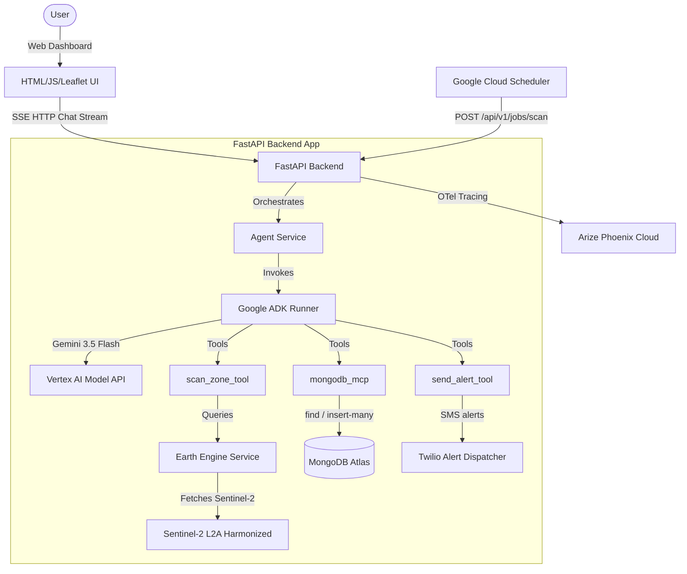
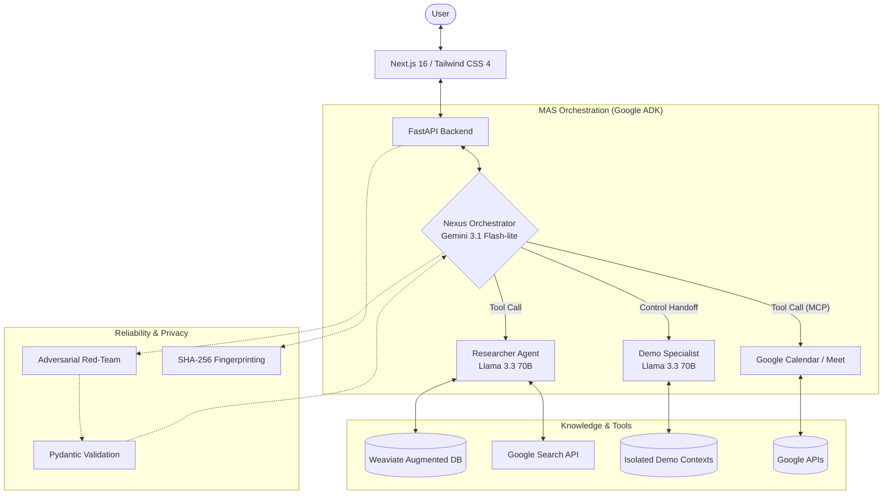

# Hi, I'm Eli 👋

**Applied AI Engineer** focused on building production-oriented AI systems that automate real-world workflows.

I design and deploy multi-agent systems that move beyond prototypes into **reliable, task-oriented tools**.

---

## 🚀 Featured Project: Sentinel Flood-Watch

**Sentinel Flood-Watch** is an intelligent, agentic remote sensing and monitoring system designed to proactively detect and report human encroachment, illegal construction, and waste dumping within Accra's critical ecological and flood-prone zones (such as the Odaw River, Korle Lagoon, Sakumono Ramsar Site, and Densu Delta Ramsar Site).

👉 It highlights the power of combining agentic AI (Google ADK + Gemini 3.5 Flash) with geospatial data analysis (Google Earth Engine) to solve real-world environmental and disaster-prevention challenges.

### 🎬 Demo

   

*Walkthrough showing remote sensing index comparisons (NDVI/MNDWI), ReAct agent reasoning stream, geocoding grounding, and dashboard operations.*

### 🔑 Key Capabilities
- **Geospatial Remote Sensing:** Integrated Google Earth Engine (Sentinel-2 L2A) to dynamically compute vegetation (NDVI) and water (MNDWI) indices.
- **Stateful Agent Workflows:** ReAct agent orchestration using Google ADK to analyze spatial data, log alerts, and trigger notification pipelines.
- **Grounded Geocoding:** Custom geocoding tools leveraging OpenStreetMap and DuckDuckGo to translate natural-language landmarks into precise coordinates, preventing coordinate hallucination.
- **Real-Time Streamed UI:** Real-time server-sent events (SSE) chat streaming that visualizes model reasoning step-by-step alongside visual band comparisons.
- **Production Safety Guardrails:** Google Cloud Model Armor integration with a custom ADK callback fallback ensuring 100% compliance during security incidents.
- **End-to-End Observability:** Integrated OpenTelemetry tracing forwarded to Arize Phoenix Cloud for complete visibility of model trajectories and tool performance.

---

### 🏗️ Architecture

➡️ [Repository Link](https://github.com/Hou-dini/sentinel-flood-watch)

---

## 🚀 Featured Project: Project Mirror

**Project Mirror** is a multi-agent AI system designed to act as a professional assistant—handling tasks like information retrieval, scheduling, and technical reasoning through coordinated agent workflows.

👉 It demonstrates how AI systems can operate in **real environments**, where outputs directly influence decisions and actions.

### 🎬 Demo

   

*Short walkthrough demonstrating multi-agent coordination, task execution, and real workflow automation.*

### 🔑 Key Capabilities
- Multi-agent orchestration for complex task execution  
- Retrieval-augmented reasoning (RAG) with strict context isolation  
- Real-world tool integration (e.g., scheduling via APIs)  
- Structured outputs and validation for reliability  
- Observability into system behavior and failure modes  

### 🧠 Why it matters
Most AI projects demonstrate isolated capabilities.  
Project Mirror focuses on **system reliability, coordination, and real usability**.

### 🏗️ Architecture

➡️ [Repository Link](https://github.com/Hou-dini/project-mirror-overview)

---

## 🧪 Additional Project: Kognia AI

**Kognia AI** is a hierarchical multi-agent system for autonomous research synthesis, strategic analysis, and report generation to support fast decision making.

   

- Automated research and analysis workflows using agent coordination  
- Real-time orchestration visibility and logging  
- Structured reasoning pipelines for consistency  

➡️ [Source Code](https://github.com/Hou-dini/kognia_backend)

---

## ⚙️ What I Focus On

- Designing **multi-agent systems** that handle real tasks  
- Improving **LLM reliability** through validation and grounding  
- Building systems that balance **latency, cost, and accuracy**  
- Turning complex workflows into **usable AI tools**  

---

## 🛠️ Tech Stack

**AI / Systems**
- Multi-agent orchestration (Google ADK, MCP)  
- Spatial / Remote Sensing (Google Earth Engine, Leaflet.js)
- RAG systems (Weaviate, structured outputs)  
- Model routing, evaluation, and safety guardrails (Model Armor)  

**Backend**
- Python (FastAPI, asyncio)  
- REST APIs, SSE streaming, microservices  

**Data**
- PostgreSQL, MongoDB Atlas  
- Vector databases (Weaviate)  

**Infra & Observability**
- OpenTelemetry, Arize Phoenix Cloud
- Docker, CI/CD (GitHub Actions)  
- Cloud deployment (GCP Cloud Run, Vercel)  

---

## 📫 Contact

- Email: elikplimkudowor@gmail.com  
- LinkedIn: https://linkedin.com/in/elikplim-kudowor  
